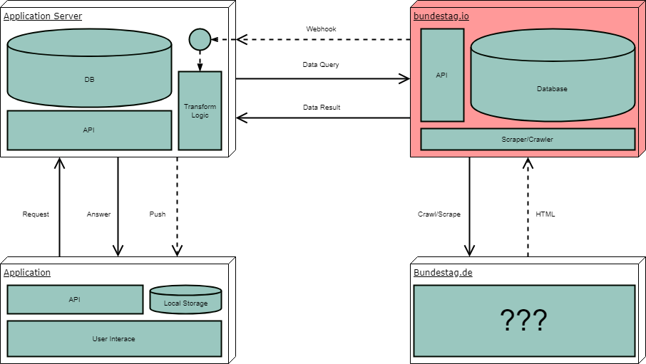

# Bundestag.io &nbsp; <a href="https://github.com/kriasoft/nodejs-api-starter/stargazers" target="_blank"></a>  <a href="https://twitter.com/democracy_de" target="_blank"></a>  <a href="https://www.facebook.com/democracygermany/" target="_blank"></a>  <a href="https://discord.gg/Pdu3ZEV" target="_blank"></a>

This is a GraphQL API for data from [bundestag.de].




## Getting started

Run the following:
```
git clone git@github.com:bundestag/bundestag.io.git
cd bundestag.io
```

### Without docker

You need to have a [MongoDB][mongo] running as well as [NodeJS][node] installed
on your system.

If you need further configuration, you can do:
```
cp .env.example .env
```
Change `.env` if necessary.

Once this is set up, run the following:
```
yarn install
yarn run dev
```
Now visit [localhost:3100][localhost] and you should see the GraphQL playground.

### Configuration

### With docker

Run:
```
docker-compose up
```

Now visit [localhost:3100][localhost] and you should see the GraphQL playground.

## Usage

You can GraphQL queries in the GraphQL playground, e.g. try this query:

```graphql
{
  procedures(limit: 30){
    title
    currentStatus
  }
}
```

## License

Copyright © 2017-present DEMOCRACY Deutschland e.V.. This source code is licensed under the Apache 2.0 license found in the
[LICENSE](https://github.com/bundestag/bundestag.io/blob/master/LICENSE) file.

---

Made with ♥ by Team DEMOCRACY ([democracy-deutschland.de](https://www.democracy-deutschland.de)), [startnext contributors](https://www.startnext.com/democracy/unterstuetzer/) and [contributors](https://github.com/bundestag/bundestag.io/graphs/contributors)

[node]: https://nodejs.org
[mongo]: https://www.mongodb.com/
[docker]: https://www.docker.com/
[bundestag.de]: https://www.bundestag.de/
[localhost]: http://localhost:3100/
