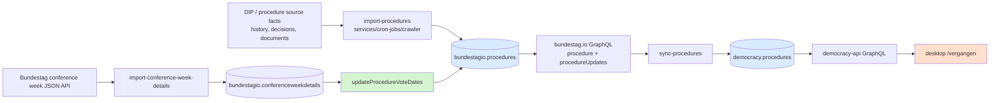
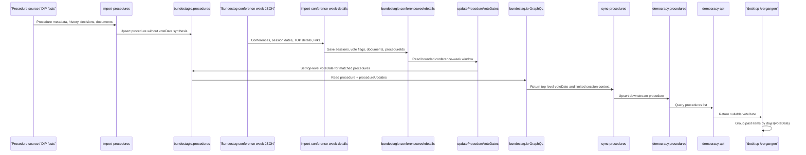
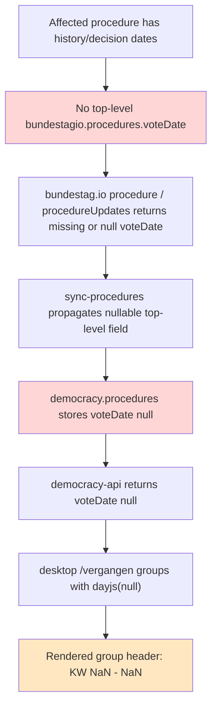
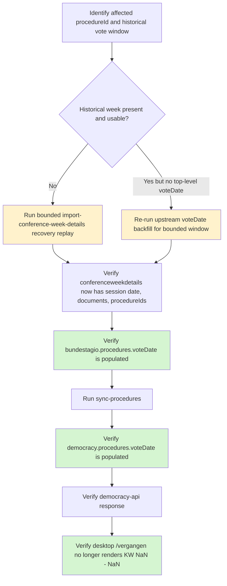

# `voteDate` end-to-end architecture

This document explains how `voteDate` moves through the full stack, where it is actually created, where it is only forwarded, how the currently known failure chain happens, and how to repair it.

For service-local details of the conference-week importer itself, see [`services/cron-jobs/import-conference-week-details/docs/votedate-flow.md`](../../services/cron-jobs/import-conference-week-details/docs/votedate-flow.md).

## Scope and current-state verdict

`voteDate` is **not** created by the main procedure importer. It is materialized later from conference-week session data and then propagated through the rest of the stack.

The currently verified failure is:

1. upstream procedure records still contain date facts in `history` / decision entries,
2. the conference-week materialization stage does not produce a top-level `bundestagio.procedures.voteDate` for affected procedures,
3. `bundestag.io` therefore exposes `voteDate` as missing / `null`,
4. `sync-procedures` propagates that nullable top-level field and cannot reconstruct a date from sessions,
5. `democracy-api` returns `voteDate: null`, and desktop `/vergangen` groups by `dayjs(item.voteDate)` without a validity guard, rendering `KW NaN - NaN`.

## Chain overview



## Ownership and materialization boundaries

| Stage | Role | `voteDate` behavior |
| --- | --- | --- |
| `services/cron-jobs/crawler/src/import-procedures/import-procedures.ts` | Imports canonical procedure metadata from DIP-derived sources | **Does not create `voteDate`**; persists procedure fields, `history`, and documents as provided/mapped |
| `services/cron-jobs/import-conference-week-details/src/services/json-fetcher.ts` + mapper/crawler | Imports Bundestag conference-week agenda/session data | Produces session dates, vote-topic classification, document references, and resolved `procedureIds` |
| `services/cron-jobs/import-conference-week-details/src/utils/update-vote-dates.ts` | Vote-date backfill owner | **The only in-repo write path that sets `bundestagio.procedures.voteDate`** |
| `bundestag.io/api` | Upstream GraphQL read layer over `bundestagio` | Exposes top-level `procedure.voteDate` and related procedure/session data; does not synthesize a missing date |
| `services/cron-jobs/sync-procedures` | Downstream propagation into `democracy` | Copies top-level `voteDate`; can derive `voteWeek`/`voteYear` only from the final returned session item when that item is vote-marked, but cannot reconstruct canonical `voteDate` because the sync query does not request `sessions.date` |
| `democracy-api` | API over `democracy.procedures` | Exposes nullable `voteDate`; does not repair it |
| `democracy/desktop/src/pages/vergangen.tsx` | Runtime presentation | Assumes `voteDate` is usable for grouping |

### Materialized vs propagated

- **Materialized here:** `updateProcedureVoteDates()` writes `voteDate` into `bundestagio.procedures`.
- **Merely propagated after that:** `bundestag.io` → `sync-procedures` → `democracy-api` → desktop.
- **Not reconstructed downstream today:** once the top-level field is missing upstream, downstream services do not derive a replacement date from `history` or session payloads.

## Source-of-truth inputs

### 1. Procedure source facts and history

`services/cron-jobs/crawler/src/import-procedures/import-procedures.ts` maps procedure source data into `bundestagio.procedures` and stores:

- `history` entries with `date` and decision metadata,
- `importantDocuments`,
- base procedure metadata.

This means date facts can exist even when top-level `voteDate` is absent. That is important for the current incident: affected upstream procedures still contain historical date evidence, but no canonical top-level `voteDate` was materialized.

### 2. Conference-week session data

`services/cron-jobs/import-conference-week-details/src/services/json-fetcher.ts` fetches Bundestag conference-week JSON, and `json-to-session-mapper.ts` maps it into:

- `sessions[].date`,
- `tops[].topic[].documents`,
- `tops[].topic[].isVote`,
- placeholder `procedureIds` that are later filled by the crawler.

The crawler then calls `getProcedureIds()` for each topic with documents and stores the result in `conferenceweekdetails`.

## Detailed data flow



## Component walkthrough

### A. `import-procedures`: stores facts, not `voteDate`

`createProcedure()` in `services/cron-jobs/crawler/src/import-procedures/import-procedures.ts` stores `history`, `importantDocuments`, and other procedure fields, then bulk-upserts them into `bundestagio.procedures`.

Important consequence:

- a procedure can exist upstream,
- contain decision/history dates,
- and still have no top-level `voteDate`.

That is expected from this importer; `voteDate` ownership is intentionally elsewhere.

### B. `import-conference-week-details`: creates the material needed for backfill

Relevant files:

- `services/cron-jobs/import-conference-week-details/src/services/json-fetcher.ts`
- `services/cron-jobs/import-conference-week-details/src/services/json-to-session-mapper.ts`
- `services/cron-jobs/import-conference-week-details/src/crawler.ts`
- `services/cron-jobs/import-conference-week-details/src/utils/vote-detection.ts`
- `services/cron-jobs/import-conference-week-details/src/utils/update-vote-dates.ts`

This stage does four things that must all succeed before a write can happen:

1. fetch the relevant conference week,
2. map a valid `sessions[].date`,
3. mark a topic as `isVote`,
4. resolve non-empty `procedureIds` from topic documents.

If any of those conditions are missing, `updateProcedureVoteDates()` has nothing usable to write.

### C. `conferenceweekdetails`: the staging collection

`bundestagio.conferenceweekdetails` is the staging store between crawl/import and procedure backfill. For `voteDate` repair, it is the first place to inspect because it answers:

- Was the historical week imported at all?
- Did the stored session keep a usable `date`?
- Did the relevant topic get `isVote: true`?
- Were `documents` captured?
- Were `procedureIds` resolved?

### D. `updateProcedureVoteDates()`: canonical write step

`services/cron-jobs/import-conference-week-details/src/utils/update-vote-dates.ts` is the authoritative backfill step.

Behavior verified from code:

- reads a **bounded** conference-week window,
- ignores sessions where `session.date` is missing,
- extracts procedure IDs only from topics where `topic.isVote` is truthy and `topic.procedureIds` is a non-empty array,
- canonicalizes duplicates so the **latest detected session date wins**, and
- runs `ProcedureModel.updateMany(..., { $set: { voteDate } })` against `bundestagio.procedures`.

### E. `bundestag.io` GraphQL: exposes, but does not synthesize

Relevant files:

- `bundestag.io/api/src/graphql/schemas/Procedure.graphql`
- `bundestag.io/api/src/graphql/resolvers/Procedure.ts`

Observed behavior:

- `Procedure.voteDate` is exposed as nullable.
- `procedureUpdates` reads procedures from `bundestagio.procedures`; if top-level `voteDate` is absent upstream, the GraphQL payload is also absent/`null`.
- The `sessions` resolver can look up conference-week entries by `procedureId`, but that is separate from the canonical top-level `voteDate` contract.

### F. `sync-procedures`: propagation only

Relevant files:

- `services/cron-jobs/sync-procedures/src/graphql/queries/getProcedureUpdates.ts`
- `services/cron-jobs/sync-procedures/src/index.ts`

Observed behavior:

- The GraphQL query requests top-level `voteDate`.
- It also requests some `sessions` metadata, but **not a session date**.
- `importProcedures()` first derives `voteWeek`, `voteYear`, and `sessionTOPHeading` only when the final returned session item is vote-marked.
- If `bIoProcedure.voteDate` exists, it then overrides `voteWeek` and `voteYear` from that canonical date.
- Because the query does not request a session date, `sync-procedures` cannot reconstruct `voteDate` from sessions.
- The sync job therefore forwards the upstream top-level field instead of recomputing it.

### G. `democracy-api`: nullable read boundary

Verified in the external `democracy-api` repository during the trace:

- `Procedure.voteDate` is exposed as nullable in the GraphQL schema.
- Past procedure selection can still include records that are considered past by completion logic or `voteEnd`, even when `voteDate` is missing.

### H. Desktop `/vergangen`: assumes `voteDate` is valid

Relevant files:

- `democracy/desktop/src/pages/vergangen.tsx`
- `democracy/desktop/src/components/templates/FilteredPage.tsx`
- `democracy/desktop/src/components/molecules/Card.tsx`

Observed behavior:

- `/vergangen` groups items with:

  ```ts
  const date = dayjs(item.voteDate);
  const week = date.isoWeek();
  const year = date.year();
  return `KW ${week} - ${year}`;
  ```

- There is no null/validity guard before grouping.
- `Card` only renders the visible date badge when `item.voteDate` is truthy, which can hide the missing date on the card while the broken group header remains visible.

## Current known failure chain

The currently verified failure chain is:



### Verified facts for the current incident

- Playwright verified that `/vergangen` still receives `voteDate: null` at runtime and renders `KW NaN - NaN`.
- MongoDB verification showed that affected records in `bundestagio.procedures` lack a top-level `voteDate`, and that this is not limited to a single record pattern.
- MongoDB verification also showed `democracy.procedures.voteDate: null`, which means downstream is propagating an upstream missing value rather than dropping an already-populated one.
- Affected upstream procedures still contain date facts in `history` / decisions, so the problem is **not** “no date facts exist anywhere”.

## First failing boundary

The first failing boundary was diagnosed **before** `updateProcedureVoteDates()` can make a successful write.

Specifically, the affected path fails at conference-week materialization/backfill preconditions:

- missing historical week coverage for the affected window,
- `sessions.date = null` for relevant March entries,
- empty `documents` / `procedureIds` in stored `conferenceweekdetails` topics.

When those conditions are present, `updateProcedureVoteDates()` skips the data naturally:

- no valid session date → session ignored,
- no resolved `procedureIds` → no candidate procedure IDs,
- historical week outside the bounded window → no read attempt,
- therefore **no write attempt** to `bundestagio.procedures.voteDate`.

This is why the earliest confirmed break is the upstream materialization stage, not the desktop page and not merely the downstream sync.

## Diagnostic checkpoints

Use the checkpoints in this order.

### 1. Upstream procedure facts exist

Check `bundestagio.procedures` for an affected `procedureId`:

```javascript
// facts exist even when voteDate is missing
 db.procedures.findOne(
   { procedureId: "<ID>" },
   { procedureId: 1, voteDate: 1, history: 1, importantDocuments: 1 }
 )
```

Expected for the known failure:

- `history` contains dated entries and/or decisions,
- top-level `voteDate` is absent.

### 2. Conference week was imported

```javascript
 db.conferenceweekdetails.findOne(
   { thisYear: <YEAR>, thisWeek: <WEEK> },
   { thisYear: 1, thisWeek: 1, sessions: 1 }
 )
```

Questions to answer:

- Is the historical week present at all?
- Does the relevant session have a non-null `date`?

### 3. Vote-topic materialization is usable

Inspect the relevant session/TOP/topic:

```javascript
 db.conferenceweekdetails.findOne(
   { thisYear: <YEAR>, thisWeek: <WEEK> },
   {
     "sessions.date": 1,
     "sessions.session": 1,
     "sessions.tops.heading": 1,
     "sessions.tops.topic.lines": 1,
     "sessions.tops.topic.isVote": 1,
     "sessions.tops.topic.documents": 1,
     "sessions.tops.topic.procedureIds": 1,
   }
 )
```

Expected failure indicators:

- `sessions.date: null`,
- empty `documents`,
- empty `procedureIds`,
- or missing historical week entirely.

### 4. Upstream canonical field exists after backfill

```javascript
 db.procedures.find(
   { voteDate: { $exists: true } },
   { procedureId: 1, voteDate: 1 }
 ).limit(5)
```

If the affected procedure still has no top-level `voteDate`, downstream systems cannot fix the record on their own.

### 5. `bundestag.io` propagates the same upstream value

Check the `procedure` / `procedureUpdates` response for the same `procedureId`.

Expected for the current failure:

- top-level `voteDate` is absent or `null`,
- session data may still exist, but the sync contract depends on the top-level field.

### 6. Downstream persistence in `democracy`

```javascript
 db.procedures.findOne(
   { procedureId: "<ID>" },
   { procedureId: 1, voteDate: 1, voteWeek: 1, voteYear: 1 }
 )
```

Expected for the current failure:

- `voteDate: null` in `democracy.procedures`.

### 7. Runtime confirmation

Check the API payload used by desktop past-procedure rendering.

Expected for the current failure:

- runtime item still contains `voteDate: null`,
- page groups into `KW NaN - NaN`.

## Why downstream cannot repair this today

### `bundestag.io`

`bundestag.io` does not synthesize `voteDate` from `history` or session lookups when the top-level field is missing. It exposes the stored procedure document as the canonical value.

### `sync-procedures`

`sync-procedures` requests:

- top-level `voteDate`, and
- session week metadata (`thisWeek`, `thisYear`, vote flag / heading),

but **not the session date itself**. Because of that, it cannot derive a canonical `voteDate` even though session-related data exists elsewhere in the upstream system.

### `democracy-api`

`democracy-api` is also not a repair stage. It reads from `democracy.procedures` and exposes nullable `voteDate` to clients.

## Repair and recovery flow

The repair path must start upstream and then move downstream.



### Operator sequence

1. **Locate the affected historical window** for the missing `voteDate`.
2. **Repair upstream conference-week coverage** with the bounded recovery replay when the week is outside the normal recent window.
3. **Verify `conferenceweekdetails` preconditions**:
   - week exists,
   - `sessions.date` is not null,
   - relevant vote topic has documents,
   - `procedureIds` is non-empty.
4. **Verify `bundestagio.procedures.voteDate`** is now populated.
5. **Run downstream `sync-procedures`** so the repaired top-level field reaches `democracy.procedures`.
6. **Re-verify API/runtime** until `voteDate` is non-null end-to-end.

### Recovery replay command

The service-local flow document already records the supported bounded replay form:

```bash
garden run import-conference-week-details -e local \
  --var VOTEDATE_RECOVERY_MODE=1 \
  --var CONFERENCE_YEAR=<YEAR> \
  --var CONFERENCE_WEEK=<WEEK> \
  --var CRAWL_MAX_REQUESTS_PER_CRAWL=<N>
```

Operational meaning:

- `VOTEDATE_RECOVERY_MODE=1` switches from “latest stored weeks” to an explicit bounded replay window,
- `CONFERENCE_YEAR` / `CONFERENCE_WEEK` choose the start of the replay window,
- `CRAWL_MAX_REQUESTS_PER_CRAWL` bounds both crawl and backfill scope.

After upstream repair, run downstream sync so the repaired canonical field is copied into `democracy`.

## Practical incident interpretation

When developers see `KW NaN - NaN` on `/vergangen`, the safest current interpretation is:

- the page is exposing a real data-contract failure,
- not inventing one,
- and the first place to debug is **upstream conference-week materialization and top-level `bundestagio.procedures.voteDate` persistence**.

A frontend validity guard would be a useful defensive fallback, but it does **not** repair the broken canonical data chain.

## Summary

- `voteDate` is **owned by conference-week backfill**, not by the base procedure importer.
- The canonical persisted field is the **top-level `bundestagio.procedures.voteDate`**.
- The currently known incident starts when conference-week materialization/backfill preconditions are missing, so no upstream write occurs.
- Downstream systems propagate the missing field; they do not reconstruct it.
- Desktop `/vergangen` is the first highly visible runtime symptom because it groups past procedures with no validity guard.
