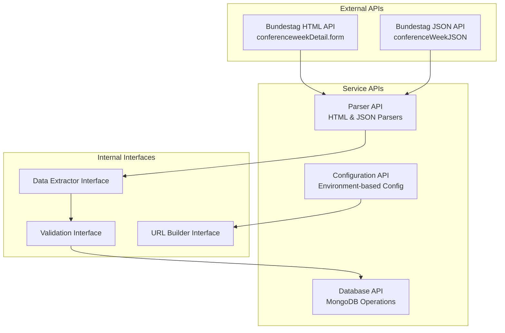
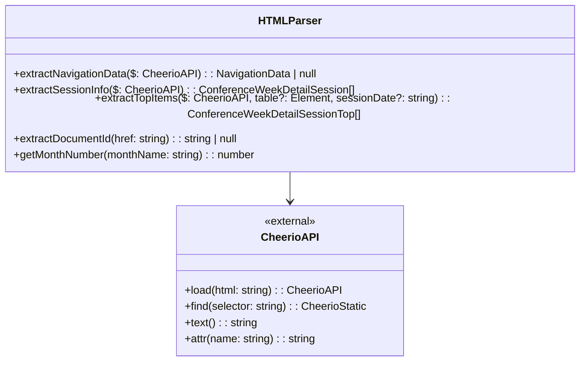
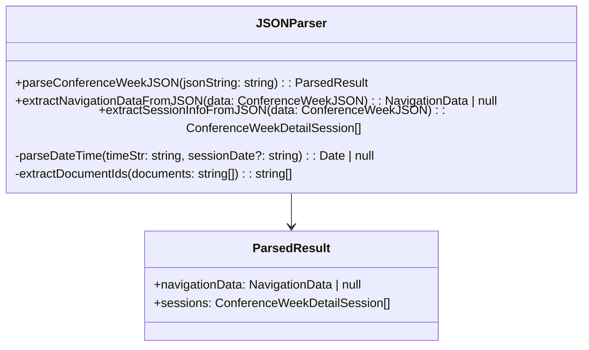
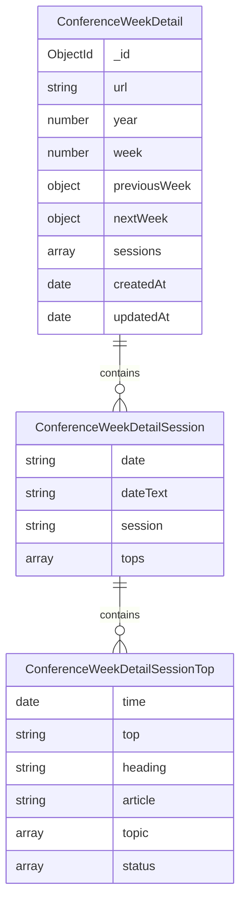
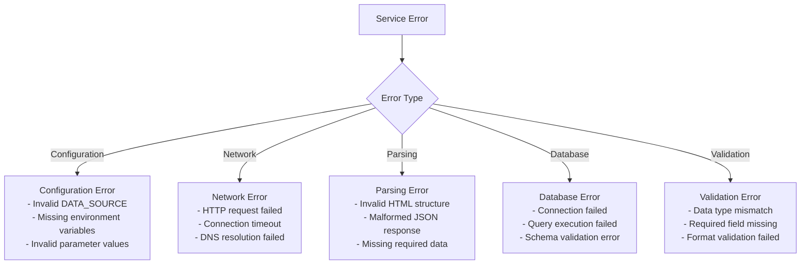
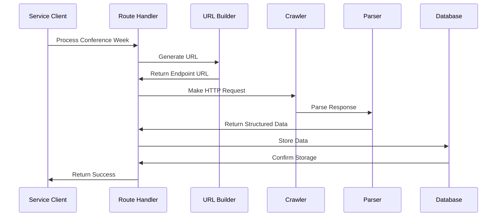

# API Documentation

## Overview

This document describes the internal APIs, data structures, and interfaces used by the import-conference-week-details service.

## Service Interface



## External API Endpoints

### Bundestag HTML API

**Endpoint**: `https://www.bundestag.de/apps/plenar/plenar/conferenceweekDetail.form`

**Parameters**:
- `year` (required): Conference year (e.g., 2025)
- `week` (required): Conference week number (e.g., 39)
- `limit` (optional): Number of results per page (default: 10)

**Example Request**:
```http
GET /apps/plenar/plenar/conferenceweekDetail.form?year=2025&week=39&limit=10
Host: www.bundestag.de
Accept: text/html
```

**Response Format**: HTML document with conference week details

### Bundestag JSON API

**Endpoint**: `https://www.bundestag.de/apps/plenar/plenar/conferenceWeekJSON`

**Parameters**:
- `year` (required): Conference year (e.g., 2025)
- `week` (required): Conference week number (e.g., 39)

**Example Request**:
```http
GET /apps/plenar/plenar/conferenceWeekJSON?year=2025&week=39
Host: www.bundestag.de
Accept: application/json
```

**Response Format**: JSON object with structured conference week data

## Data Structures

### Core Data Types

```typescript
interface ConferenceWeekDetail {
  url: string;
  year: number;
  week: number;
  previousWeek?: {
    year: number;
    week: number;
  };
  nextWeek?: {
    year: number;
    week: number;
  };
  sessions: ConferenceWeekDetailSession[];
}

interface ConferenceWeekDetailSession {
  date: string | null;
  dateText: string | null;
  session: string | null;
  tops: ConferenceWeekDetailSessionTop[];
}

interface ConferenceWeekDetailSessionTop {
  time: Date | null;
  top: string | null;
  heading: string | null;
  article: string | null;
  topic: ConferenceWeekDetailSessionTopTopic[];
  status: ConferenceWeekDetailSessionTopStatus[];
}

interface ConferenceWeekDetailSessionTopTopic {
  lines: string[];
  documents: string[];
  documentIds?: string[];
}

interface ConferenceWeekDetailSessionTopStatus {
  lines: string[];
  documents: string[];
  documentIds?: string[];
}
```

### Configuration Types

```typescript
interface AppConfig {
  conference: {
    year: number;
    week: number;
    limit: number;
  };
  crawl: {
    maxRequestsPerCrawl: number;
  };
  db: {
    url: string;
  };
  runtime: {
    isTest: boolean;
  };
  dataSource: {
    type: 'html' | 'json';
  };
}

interface NavigationData {
  previousYear?: number;
  previousWeek?: number;
  nextYear?: number;
  nextWeek?: number;
}
```

## Parser APIs

### HTML Parser Interface



**extractNavigationData**
- **Input**: CheerioAPI instance loaded with HTML
- **Output**: Navigation data or null
- **Purpose**: Extract previous/next week navigation information

```typescript
function extractNavigationData($: CheerioAPI): NavigationData | null
```

**extractSessionInfo**
- **Input**: CheerioAPI instance loaded with HTML
- **Output**: Array of conference week detail sessions
- **Purpose**: Extract all session information from HTML

```typescript
function extractSessionInfo($: CheerioAPI): ConferenceWeekDetailSession[]
```

### JSON Parser Interface



**parseConferenceWeekJSON**
- **Input**: JSON string from Bundestag API
- **Output**: Parsed result with navigation and session data
- **Purpose**: Parse complete JSON response

```typescript
function parseConferenceWeekJSON(jsonString: string): ParsedResult
```

## URL Builder API

```mermaid
classDiagram
    class URLBuilder {
        +buildConferenceWeekUrl(config: AppConfig, year?: number, week?: number): string
        +getUrlDataSource(url: string): 'html' | 'json' | null
        -buildHtmlUrl(year: number, week: number, limit: number): string
        -buildJsonUrl(year: number, week: number): string
    }
    
    class AppConfig {
        +dataSource: {type: 'html' | 'json'}
        +conference: {year: number, week: number, limit: number}
    }
    
    URLBuilder --> AppConfig
```

**buildConferenceWeekUrl**
- **Input**: Application configuration, optional year/week override
- **Output**: Complete URL for the appropriate endpoint
- **Purpose**: Generate URLs based on configuration

```typescript
function buildConferenceWeekUrl(
  config: AppConfig, 
  year?: number, 
  week?: number
): string
```

## Database API

### MongoDB Schema



### Database Operations

```typescript
interface DatabaseOperations {
  // Create or update conference week detail
  upsertConferenceWeekDetail(
    data: ConferenceWeekDetail
  ): Promise<ConferenceWeekDetail>;
  
  // Find existing conference week detail
  findConferenceWeekDetail(
    year: number, 
    week: number
  ): Promise<ConferenceWeekDetail | null>;
  
  // Update procedure references
  updateProcedureReferences(
    conferenceWeekId: string,
    procedures: string[]
  ): Promise<void>;
}
```

## Error Handling

### Error Types

```typescript
enum ErrorType {
  CONFIGURATION_ERROR = 'CONFIGURATION_ERROR',
  NETWORK_ERROR = 'NETWORK_ERROR',
  PARSING_ERROR = 'PARSING_ERROR',
  DATABASE_ERROR = 'DATABASE_ERROR',
  VALIDATION_ERROR = 'VALIDATION_ERROR'
}

interface ServiceError {
  type: ErrorType;
  message: string;
  details?: any;
  timestamp: Date;
  context?: {
    url?: string;
    year?: number;
    week?: number;
    dataSource?: string;
  };
}
```

### Error Response Format



## Internal Service APIs

### Configuration API

```typescript
interface ConfigurationAPI {
  // Load configuration from environment
  loadConfiguration(): AppConfig;
  
  // Validate configuration
  validateConfiguration(config: AppConfig): ValidationResult;
  
  // Get configuration value
  getConfigValue<T>(key: string, defaultValue?: T): T;
  
  // Check if running in test mode
  isTestMode(): boolean;
}
```

### Crawler API

```typescript
interface CrawlerAPI {
  // Initialize crawler with configuration
  initialize(config: CrawlerOptions): Promise<void>;
  
  // Add request to queue
  addRequest(url: string, userData?: any): Promise<void>;
  
  // Run crawler
  run(): Promise<CrawlerRunResult>;
  
  // Get crawl results
  getResults(): ConferenceWeekDetail[];
  
  // Reset crawler state
  reset(): void;
}
```

## Data Flow APIs

### Request Processing Flow



### Data Validation API

```typescript
interface ValidationAPI {
  // Validate conference week detail structure
  validateConferenceWeekDetail(
    data: ConferenceWeekDetail
  ): ValidationResult;
  
  // Validate session data
  validateSession(
    session: ConferenceWeekDetailSession
  ): ValidationResult;
  
  // Validate TOP data
  validateTop(
    top: ConferenceWeekDetailSessionTop
  ): ValidationResult;
  
  // Validate document IDs
  validateDocumentIds(
    documentIds: string[]
  ): ValidationResult;
}

interface ValidationResult {
  isValid: boolean;
  errors: ValidationError[];
  warnings: ValidationWarning[];
}
```

## Testing APIs

### Test Utilities

```typescript
interface TestUtilities {
  // Create mock HTML response
  createMockHtmlResponse(
    year: number, 
    week: number
  ): string;
  
  // Create mock JSON response
  createMockJsonResponse(
    year: number, 
    week: number
  ): ConferenceWeekJSON;
  
  // Compare parser outputs
  compareParserOutputs(
    htmlResult: ConferenceWeekDetailSession[],
    jsonResult: ConferenceWeekDetailSession[]
  ): ComparisonResult;
  
  // Generate realistic test data
  generateRealisticTestData(): ConferenceWeekDetail;
}
```

### Mock Data Structures

```typescript
interface MockDataProvider {
  // Get mock HTML content
  getMockHtmlContent(scenario: TestScenario): string;
  
  // Get mock JSON response
  getMockJsonResponse(scenario: TestScenario): ConferenceWeekJSON;
  
  // Get expected parsed result
  getExpectedResult(scenario: TestScenario): ConferenceWeekDetail;
}

enum TestScenario {
  BASIC_SESSION = 'BASIC_SESSION',
  MULTIPLE_SESSIONS = 'MULTIPLE_SESSIONS',
  COMPLEX_TOPICS = 'COMPLEX_TOPICS',
  EMPTY_RESPONSE = 'EMPTY_RESPONSE',
  ERROR_RESPONSE = 'ERROR_RESPONSE'
}
```

## Performance Monitoring APIs

### Metrics Collection

```typescript
interface MetricsAPI {
  // Record processing time
  recordProcessingTime(
    duration: number, 
    dataSource: string
  ): void;
  
  // Record error occurrence
  recordError(
    errorType: ErrorType, 
    context?: any
  ): void;
  
  // Record data quality metrics
  recordDataQuality(
    sessionsCount: number,
    topsCount: number,
    documentsCount: number
  ): void;
  
  // Get current metrics
  getCurrentMetrics(): ServiceMetrics;
}

interface ServiceMetrics {
  processedWeeks: number;
  averageProcessingTime: number;
  errorRate: number;
  lastSuccessfulRun: Date;
  dataQualityScore: number;
}
```

This API documentation provides comprehensive coverage of all interfaces and data structures used within the import-conference-week-details service, enabling effective integration and maintenance.