# Import Conference Week Details - Architecture Documentation

## Overview

The `import-conference-week-details` service is a data ingestion service that crawls and imports conference week details from the German Bundestag website. It supports both HTML parsing and JSON API endpoints with configurable A/B testing capabilities.

## System Architecture

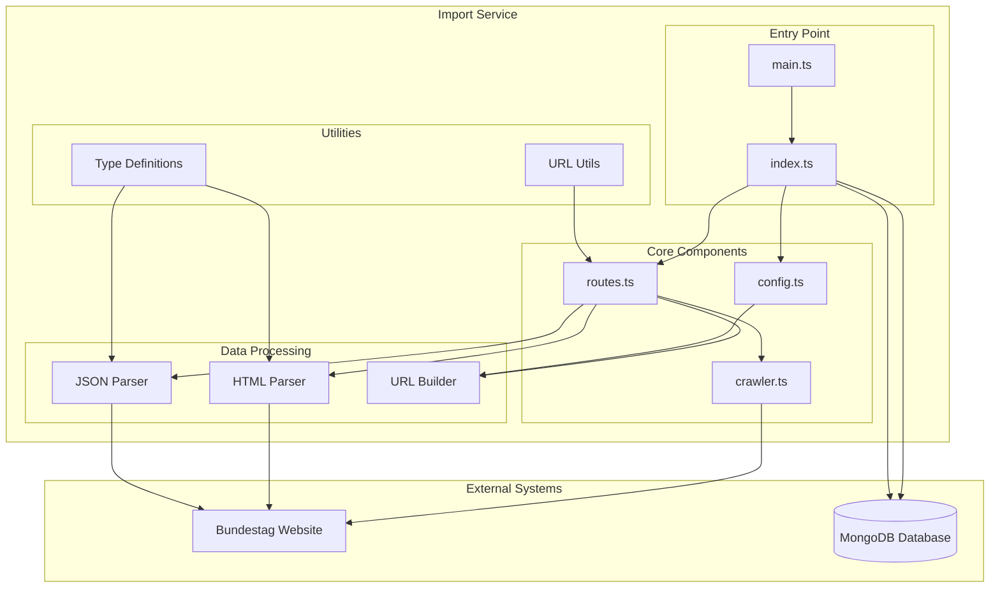

## Component Overview

### Core Components

| Component | Purpose | Key Responsibilities |
|-----------|---------|---------------------|
| `main.ts` | Application entry point | Process orchestration, error handling |
| `index.ts` | Main processing logic | Database operations, data transformation |
| `config.ts` | Configuration management | Environment variables, validation |
| `routes.ts` | Request routing | URL handling, parser selection |
| `crawler.ts` | Web crawling | HTTP requests, response handling |

### Data Processing Components

| Component | Purpose | Key Responsibilities |
|-----------|---------|---------------------|
| `html-parser.ts` | HTML data extraction | Parse HTML responses, extract session data |
| `json-parser.ts` | JSON data extraction | Parse JSON responses, normalize data structure |
| `url-builder.ts` | URL generation | Generate appropriate URLs based on configuration |

### Utility Components

| Component | Purpose | Key Responsibilities |
|-----------|---------|---------------------|
| `url.ts` | URL processing | Parse URL parameters, extract metadata |
| `types.ts` | Type definitions | TypeScript interfaces, data structures |

## Data Flow Architecture

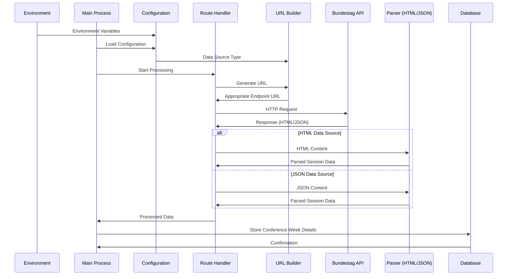

## Configuration-Driven Architecture

The service implements a flexible configuration system that enables A/B testing between data sources:

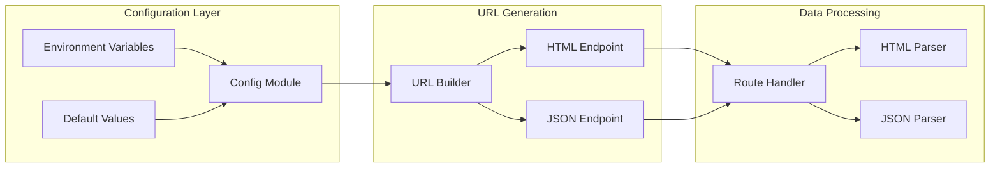

### Configuration Options

| Variable | Default | Purpose |
|----------|---------|---------|
| `DATA_SOURCE` | `html` | Switch between `html` and `json` data sources |
| `CONFERENCE_YEAR` | `2025` | Starting year for data extraction |
| `CONFERENCE_WEEK` | `37` | Starting week for data extraction |
| `CONFERENCE_LIMIT` | `10` | Results per page (HTML only) |
| `CRAWL_MAX_REQUESTS_PER_CRAWL` | `10` | Request limit per crawl session |
| `DB_URL` | `mongodb://localhost:27017/bundestagio` | Database connection string |

## Data Source Switching Mechanism

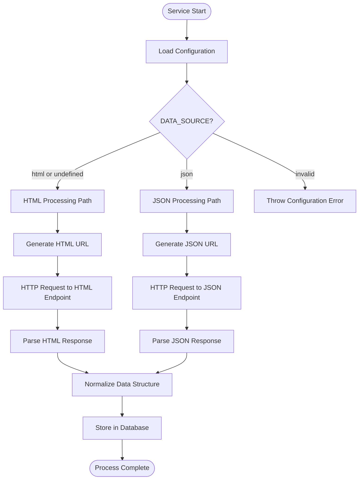

## Parser Architecture

Both parsers implement the same interface and produce identical data structures:

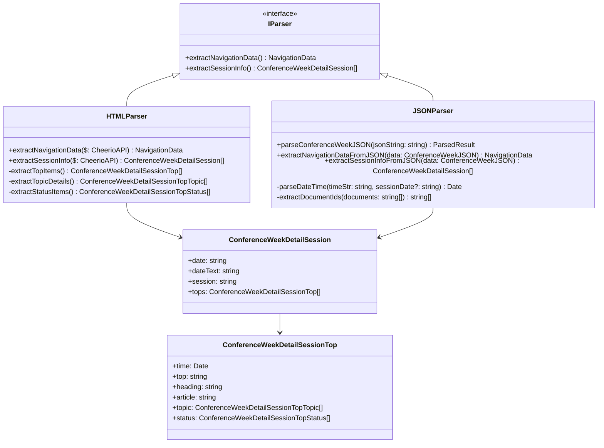

## Testing Architecture

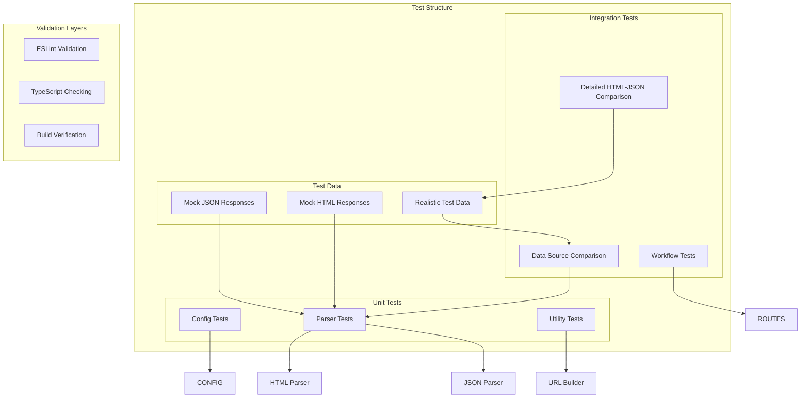

### Test Coverage Areas

| Test Type | Purpose | Coverage |
|-----------|---------|----------|
| **Unit Tests** | Individual component testing | Config, parsers, utilities |
| **Integration Tests** | End-to-end workflow testing | Complete data processing pipeline |
| **Comparison Tests** | Data consistency validation | HTML vs JSON parser output |
| **Edge Case Tests** | Error handling and boundary conditions | Empty responses, invalid data |

## Database Schema

The service stores data in MongoDB using the following schema structure:

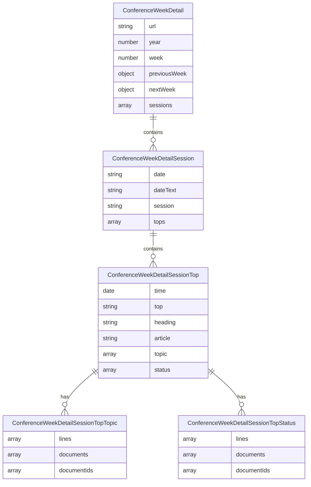

## Performance Considerations

### Crawling Strategy

```mermaid
graph LR
    subgraph "Request Management"
        QUEUE[Request Queue]
        LIMITER[Rate Limiter]
        RETRY[Retry Logic]
    end
    
    subgraph "Processing Strategy"
        CONCURRENT[Concurrent Processing]
        DEDUP[Deduplication]
        CACHE[Response Caching]
    end
    
    subgraph "Resource Management"
        MEMORY[Memory Management]
        CONNECTION[Connection Pooling]
        TIMEOUT[Request Timeouts]
    end
    
    QUEUE --> LIMITER
    LIMITER --> RETRY
    RETRY --> CONCURRENT
    CONCURRENT --> DEDUP
    DEDUP --> CACHE
    CACHE --> MEMORY
    MEMORY --> CONNECTION
    CONNECTION --> TIMEOUT
```

### Optimization Features

- **Request Rate Limiting**: Configurable crawl limits to respect server resources
- **Deduplication**: Prevent processing the same URL multiple times
- **Connection Management**: Efficient HTTP connection handling
- **Memory Management**: Controlled resource usage during processing
- **Error Recovery**: Robust error handling and retry mechanisms

## Deployment Architecture

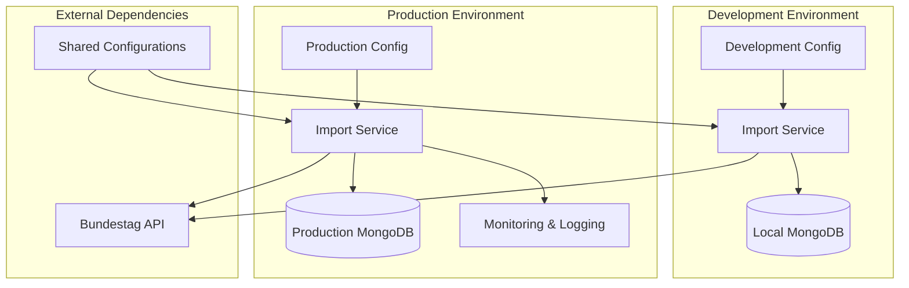

## Security Considerations

### Data Protection

- **Input Validation**: All external data is validated before processing
- **SQL Injection Prevention**: Using parameterized queries with MongoDB
- **Rate Limiting**: Protection against service abuse
- **Error Handling**: Secure error messages without sensitive information

### Configuration Security

- **Environment Variables**: Sensitive configuration stored in environment variables
- **Default Values**: Secure defaults for all configuration options
- **Validation**: Configuration validation at startup

## Monitoring and Observability

### Logging Strategy

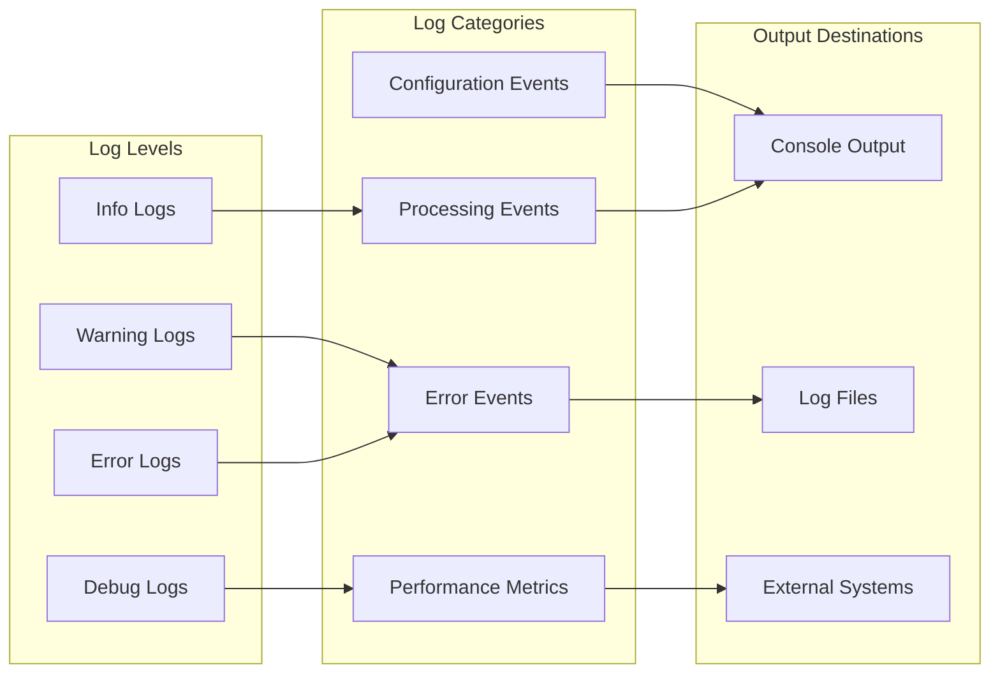

### Key Metrics

- **Processing Time**: Time taken to process each conference week
- **Success Rate**: Percentage of successful data extractions
- **Error Rate**: Frequency and types of errors encountered  
- **Data Consistency**: Validation of data quality between sources
- **Resource Usage**: Memory and CPU utilization patterns

## Future Enhancements

### Planned Improvements

1. **Additional Data Sources**: Support for more Bundestag data endpoints
2. **Real-time Processing**: WebSocket or SSE support for live updates
3. **Advanced Caching**: Redis-based caching for improved performance
4. **Data Validation**: Enhanced data quality checks and validation rules
5. **API Integration**: REST API for external system integration

### Scalability Considerations

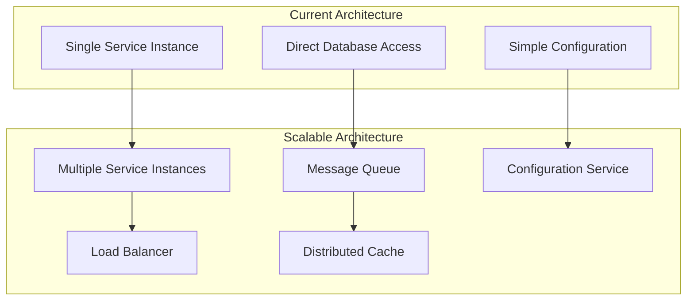

This architecture documentation provides a comprehensive overview of the import-conference-week-details service, including its design patterns, data flow, and operational characteristics. The service is designed with flexibility, maintainability, and scalability in mind, supporting both current requirements and future enhancements.