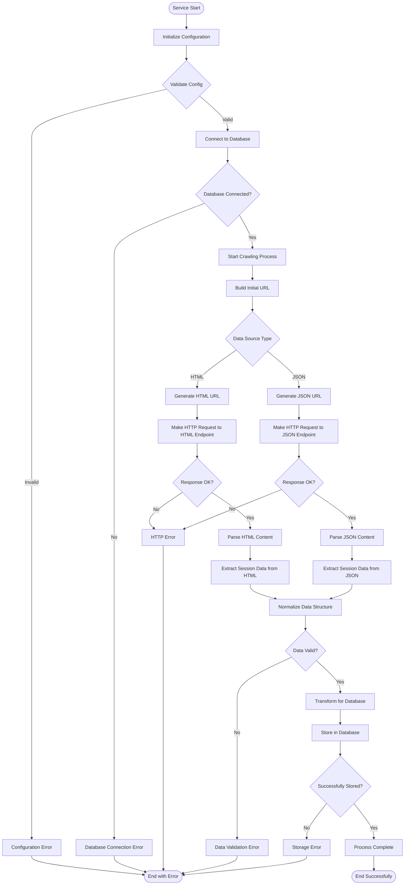
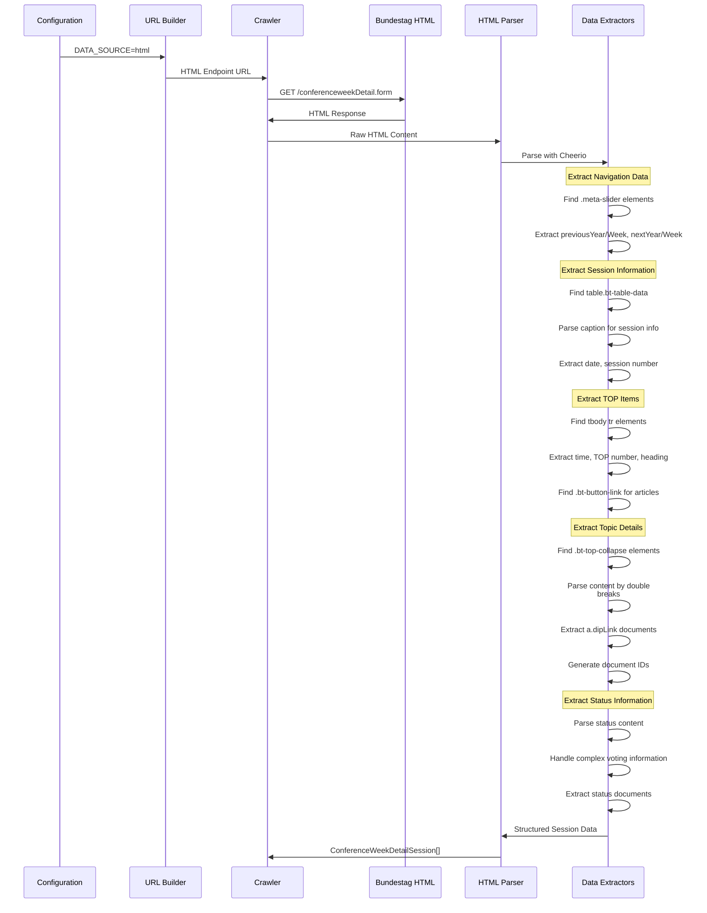
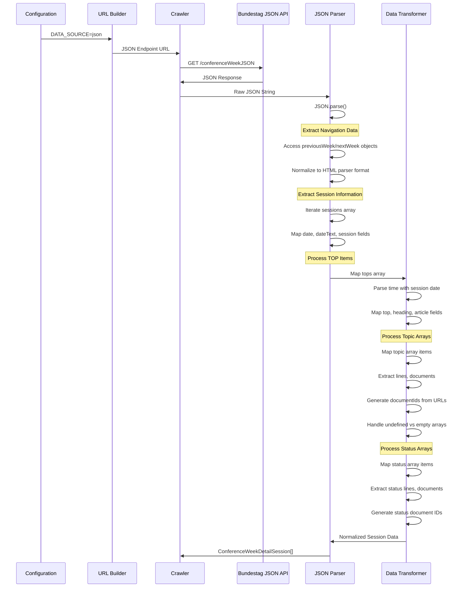
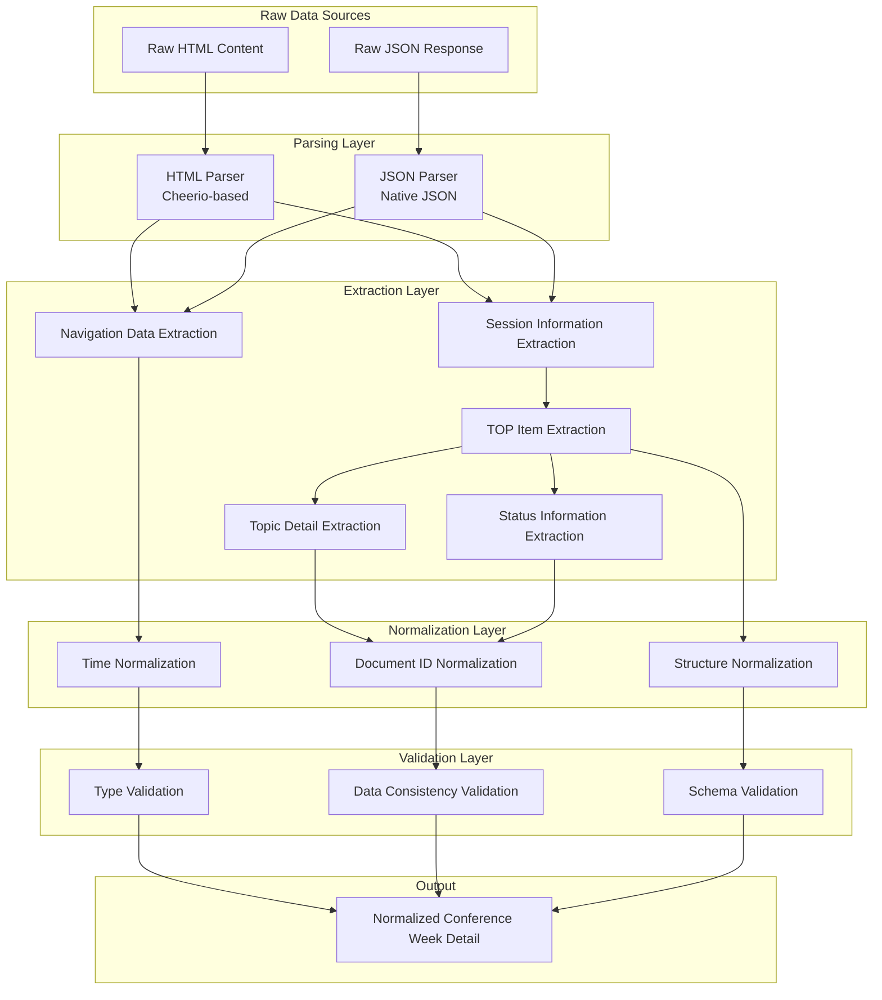
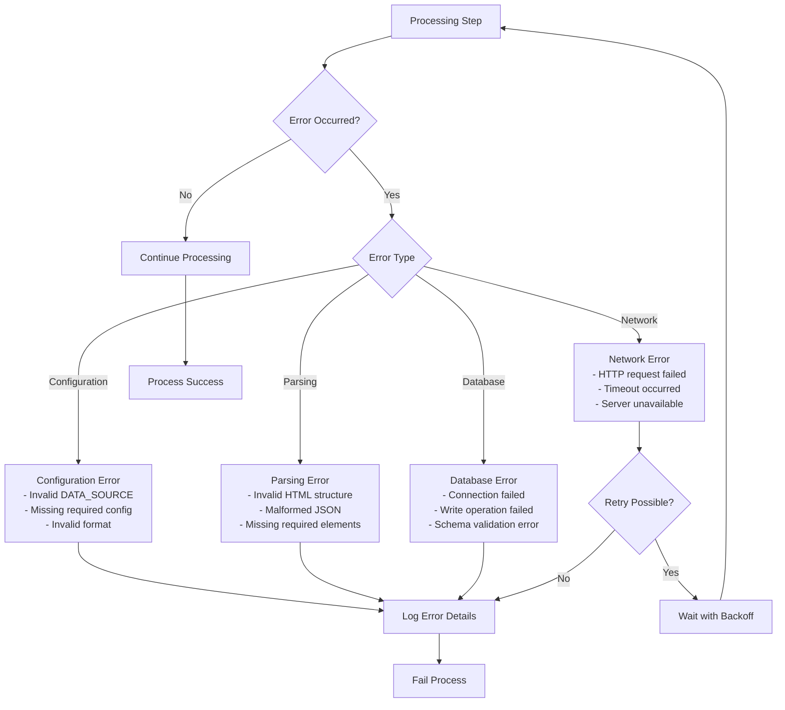
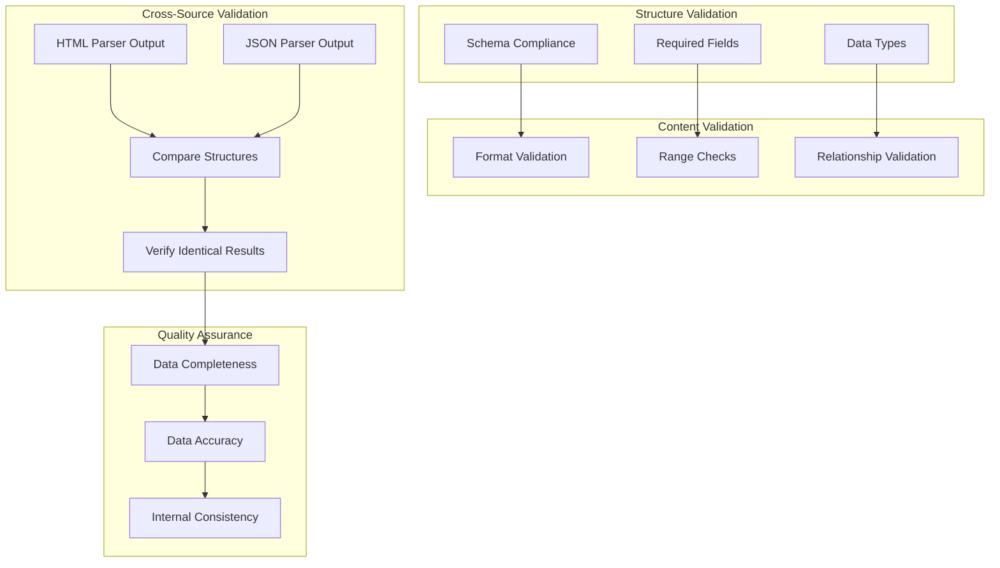
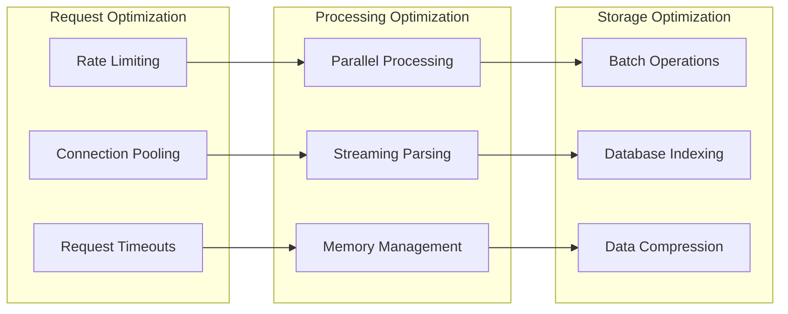

# Data Flow Documentation

## Overview

This document describes the detailed data flow through the import-conference-week-details service, covering both HTML and JSON processing paths.

## Complete Data Processing Pipeline



## HTML Processing Flow



## JSON Processing Flow



## Data Transformation Pipeline



## Document ID Processing

Document IDs are processed consistently across both data sources:

```mermaid
flowchart LR
    DOC_URL[Document URL<br/>https://dserver.bundestag.de/btd/20/038/2003858.pdf]
    
    REGEX[Regex Pattern<br/>/btd/(\d{2})/(\d{3})/(\d+)\.pdf$/]
    
    EXTRACT[Extract Components<br/>major: 20<br/>minor: 038<br/>fullId: 2003858]
    
    PROCESS[Process ID<br/>actualNumber = fullId.substring(-4)<br/>parsedNumber = parseInt(actualNumber)]
    
    RESULT[Document ID<br/>20/3858]
    
    DOC_URL --> REGEX
    REGEX --> EXTRACT
    EXTRACT --> PROCESS
    PROCESS --> RESULT
```

## Time Processing Pipeline

Time information is handled differently based on the data source:

```mermaid
graph TD
    subgraph "HTML Time Processing"
        HTML_TIME[Time String: "09:00"]
        HTML_DATE[Session Date: "2025-09-27"]
        HTML_PARSER[parseTimeString function]
        HTML_RESULT[Date: 2025-09-27T09:00:00.000Z]
    end
    
    subgraph "JSON Time Processing"
        JSON_TIME[Time String: "09:00"]
        JSON_DATE[Session Date: "2025-09-27"]
        JSON_PARSER[parseDateTime function]
        JSON_RESULT[Date: 2025-09-27T09:00:00.000Z]
    end
    
    subgraph "Consistency Validation"
        COMPARE[Compare Results]
        IDENTICAL[Identical Timestamps]
    end
    
    HTML_TIME --> HTML_PARSER
    HTML_DATE --> HTML_PARSER
    HTML_PARSER --> HTML_RESULT
    
    JSON_TIME --> JSON_PARSER
    JSON_DATE --> JSON_PARSER
    JSON_PARSER --> JSON_RESULT
    
    HTML_RESULT --> COMPARE
    JSON_RESULT --> COMPARE
    COMPARE --> IDENTICAL
```

## Error Handling Flow



## Data Consistency Validation

The service implements comprehensive validation to ensure data consistency:



## Performance Optimization



This data flow documentation provides detailed insight into how data moves through the import-conference-week-details service, ensuring transparency and maintainability of the processing pipeline.