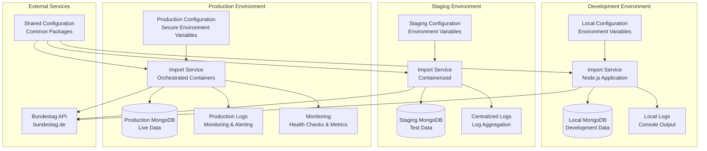
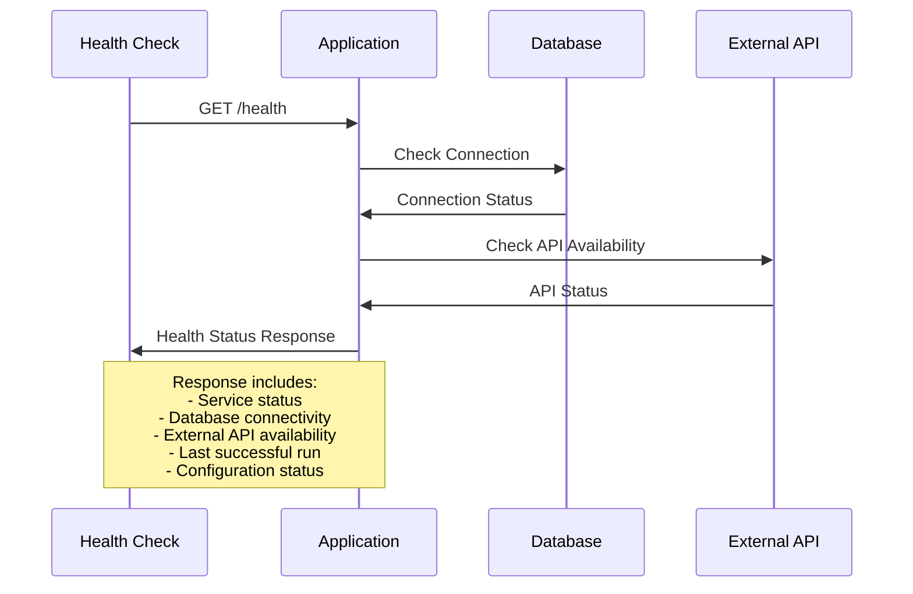
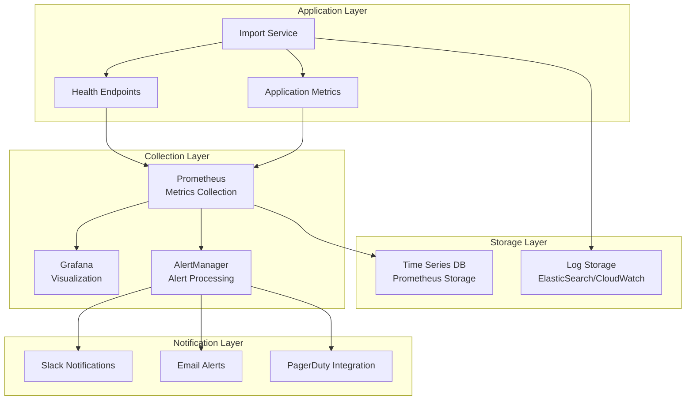
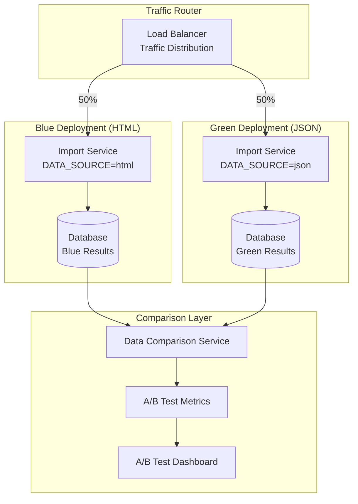
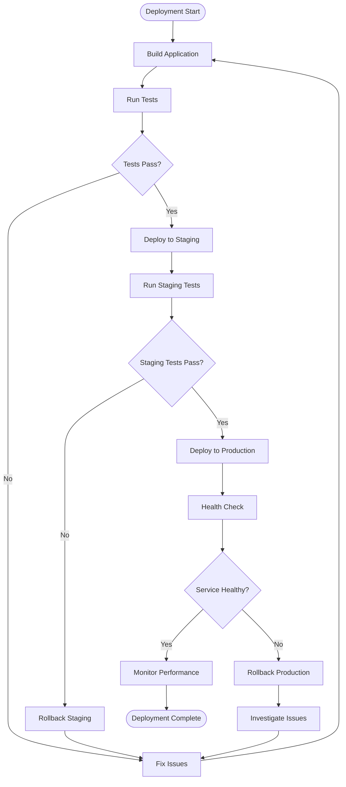
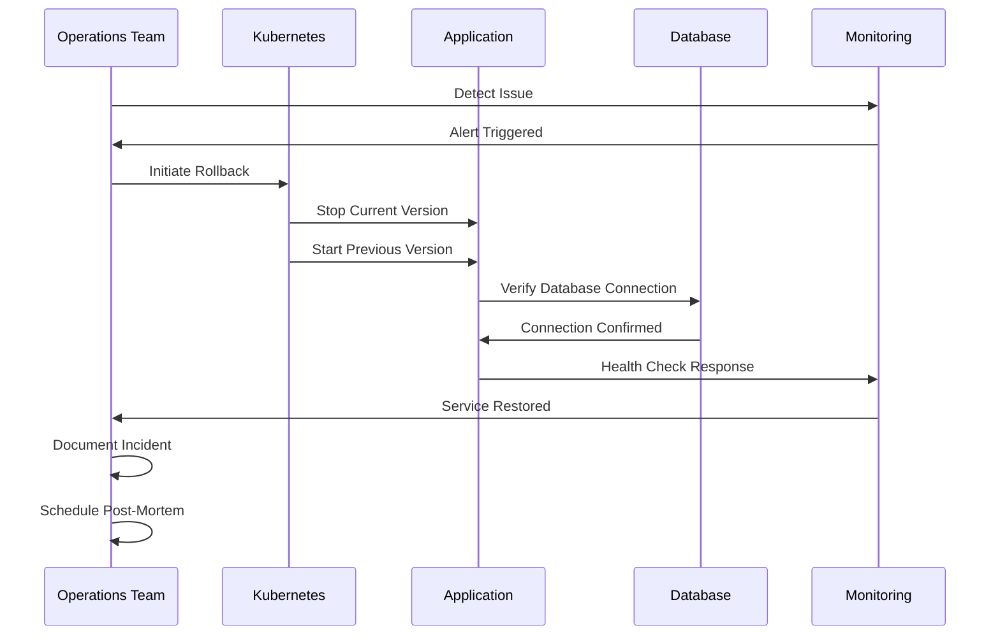
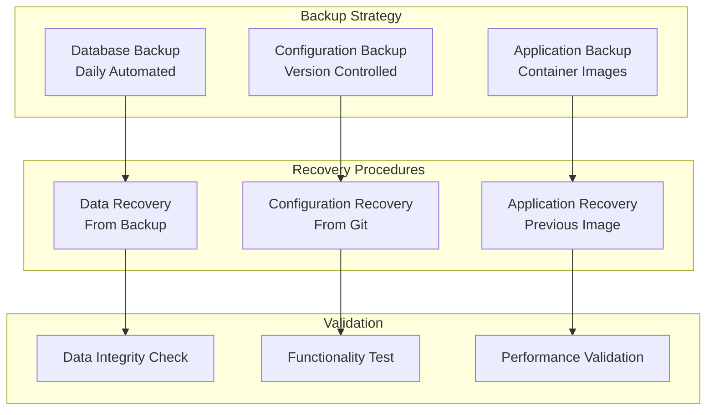
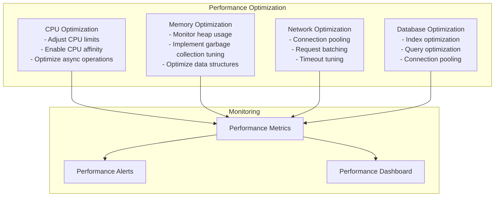
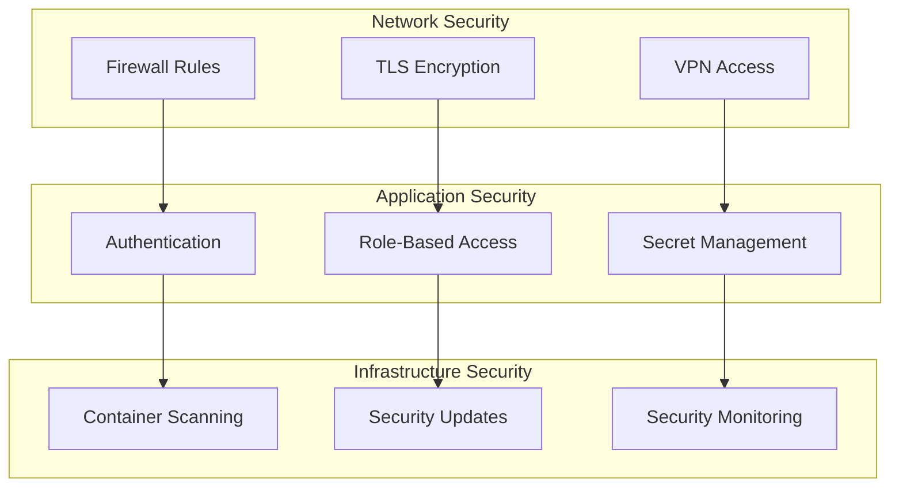

# Deployment & Operations Guide

## Overview

This document provides comprehensive guidance for deploying, configuring, and operating the import-conference-week-details service in various environments.

## Deployment Architecture



## Environment Configuration

### Development Environment

```bash
# Development configuration
NODE_ENV=development
DATA_SOURCE=html
CONFERENCE_YEAR=2025
CONFERENCE_WEEK=39
CONFERENCE_LIMIT=5
CRAWL_MAX_REQUESTS_PER_CRAWL=5
DB_URL=mongodb://localhost:27017/bundestagio-dev
LOG_LEVEL=debug
```

### Staging Environment

```bash
# Staging configuration
NODE_ENV=staging
DATA_SOURCE=html
CONFERENCE_YEAR=2025
CONFERENCE_WEEK=39
CONFERENCE_LIMIT=10
CRAWL_MAX_REQUESTS_PER_CRAWL=10
DB_URL=mongodb://staging-db:27017/bundestagio-staging
LOG_LEVEL=info
```

### Production Environment

```bash
# Production configuration
NODE_ENV=production
DATA_SOURCE=html  # or json for A/B testing
CONFERENCE_YEAR=2025
CONFERENCE_WEEK=39
CONFERENCE_LIMIT=10
CRAWL_MAX_REQUESTS_PER_CRAWL=10
DB_URL=mongodb://prod-db-cluster:27017/bundestagio
LOG_LEVEL=info
```

## Container Deployment

### Dockerfile

```dockerfile
FROM node:18-alpine

# Set working directory
WORKDIR /app

# Copy package files
COPY package.json pnpm-lock.yaml ./

# Install dependencies
RUN npm install -g pnpm && pnpm install --frozen-lockfile

# Copy source code
COPY . .

# Build application
RUN pnpm build

# Expose port (if needed for health checks)
EXPOSE 3000

# Set user for security
USER node

# Start application
CMD ["node", "build/index.js"]
```

### Docker Compose

```yaml
version: '3.8'

services:
  import-service:
    build: .
    environment:
      - DATA_SOURCE=html
      - CONFERENCE_YEAR=2025
      - CONFERENCE_WEEK=39
      - DB_URL=mongodb://mongodb:27017/bundestagio
    depends_on:
      - mongodb
    restart: unless-stopped
    networks:
      - app-network

  mongodb:
    image: mongo:6
    volumes:
      - mongodb_data:/data/db
    networks:
      - app-network
    restart: unless-stopped

volumes:
  mongodb_data:

networks:
  app-network:
    driver: bridge
```

## Kubernetes Deployment

### Deployment Configuration

```yaml
apiVersion: apps/v1
kind: Deployment
metadata:
  name: import-conference-week-details
  labels:
    app: import-conference-week-details
spec:
  replicas: 1
  selector:
    matchLabels:
      app: import-conference-week-details
  template:
    metadata:
      labels:
        app: import-conference-week-details
    spec:
      containers:
      - name: import-service
        image: democracy-development/import-conference-week-details:latest
        env:
        - name: DATA_SOURCE
          valueFrom:
            configMapKeyRef:
              name: import-config
              key: data-source
        - name: DB_URL
          valueFrom:
            secretKeyRef:
              name: database-secret
              key: connection-string
        resources:
          requests:
            memory: "256Mi"
            cpu: "100m"
          limits:
            memory: "512Mi"
            cpu: "500m"
        livenessProbe:
          exec:
            command:
            - /bin/sh
            - -c
            - "ps aux | grep '[n]ode' || exit 1"
          initialDelaySeconds: 30
          periodSeconds: 10
        readinessProbe:
          exec:
            command:
            - /bin/sh
            - -c
            - "ps aux | grep '[n]ode' || exit 1"
          initialDelaySeconds: 5
          periodSeconds: 5
```

### ConfigMap

```yaml
apiVersion: v1
kind: ConfigMap
metadata:
  name: import-config
data:
  data-source: "html"
  conference-year: "2025"
  conference-week: "39"
  conference-limit: "10"
  crawl-max-requests: "10"
  log-level: "info"
```

### Secret

```yaml
apiVersion: v1
kind: Secret
metadata:
  name: database-secret
type: Opaque
data:
  connection-string: bW9uZ29kYjovL3Byb2QtZGI6MjcwMTcvYnVuZGVzdGFnaW8=  # base64 encoded
```

## Monitoring and Observability

### Health Check Endpoint



### Monitoring Stack



### Key Metrics

| Metric | Type | Description | Alert Threshold |
|--------|------|-------------|-----------------|
| `conference_week_processing_duration` | Histogram | Time to process a conference week | > 300s |
| `conference_week_processing_total` | Counter | Total number of processed weeks | Rate decrease |
| `conference_week_processing_errors` | Counter | Number of processing errors | > 5/hour |
| `database_connection_status` | Gauge | Database connection health | 0 (disconnected) |
| `external_api_response_time` | Histogram | Bundestag API response time | > 10s |
| `external_api_errors` | Counter | External API errors | > 10/hour |
| `memory_usage_bytes` | Gauge | Memory usage | > 400MB |
| `cpu_usage_percent` | Gauge | CPU usage percentage | > 80% |

## A/B Testing Deployment

### Blue-Green Deployment for A/B Testing



### A/B Testing Configuration

```yaml
# Blue environment (HTML)
apiVersion: v1
kind: ConfigMap
metadata:
  name: import-config-blue
data:
  data-source: "html"
  deployment-variant: "blue"

---

# Green environment (JSON)
apiVersion: v1
kind: ConfigMap
metadata:
  name: import-config-green
data:
  data-source: "json"
  deployment-variant: "green"
```

## Operational Procedures

### Deployment Process



### Rollback Procedure



### Backup and Recovery



## Troubleshooting Guide

### Common Issues

| Issue | Symptoms | Diagnosis | Resolution |
|-------|----------|-----------|------------|
| **Configuration Error** | Service fails to start | Check logs for config validation errors | Verify environment variables |
| **Database Connection** | Connection timeout errors | Test database connectivity | Check network, credentials |
| **External API Issues** | HTTP errors from Bundestag | Monitor API response codes | Implement retry logic, contact support |
| **Memory Issues** | Out of memory errors | Monitor memory usage metrics | Increase memory limits, optimize code |
| **Performance Degradation** | Slow processing times | Check processing duration metrics | Optimize queries, increase resources |

### Diagnostic Commands

```bash
# Check service status
kubectl get pods -l app=import-conference-week-details

# View logs
kubectl logs -f deployment/import-conference-week-details

# Check resource usage
kubectl top pods -l app=import-conference-week-details

# Execute health check
kubectl exec -it deployment/import-conference-week-details -- node -e "console.log('Health check')"

# Check configuration
kubectl get configmap import-config -o yaml

# View secrets (masked)
kubectl get secret database-secret -o yaml
```

### Performance Tuning



## Security Considerations

### Security Checklist

- [ ] Environment variables encrypted at rest
- [ ] Network traffic encrypted in transit
- [ ] Container runs as non-root user
- [ ] Resource limits configured
- [ ] Security scanning enabled
- [ ] Access logs monitored
- [ ] Regular security updates applied

### Security Architecture



This deployment guide provides comprehensive coverage of operational aspects for the import-conference-week-details service, ensuring reliable and secure operations across all environments.