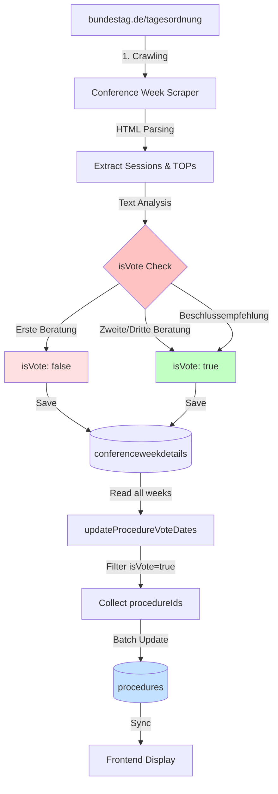
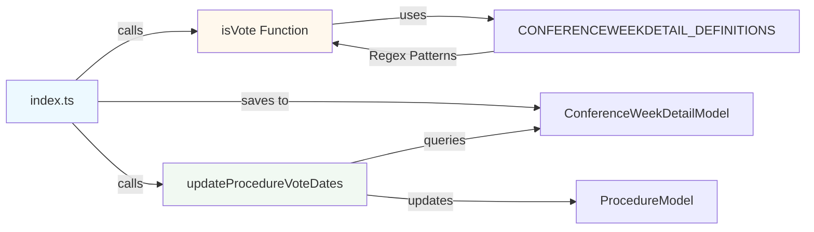
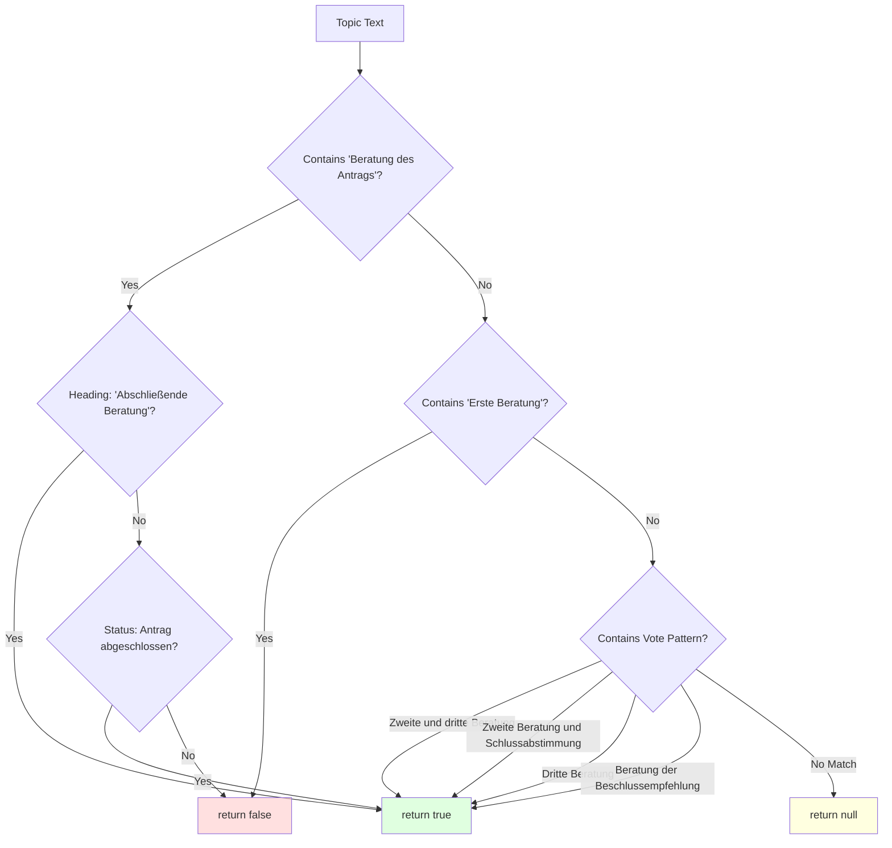
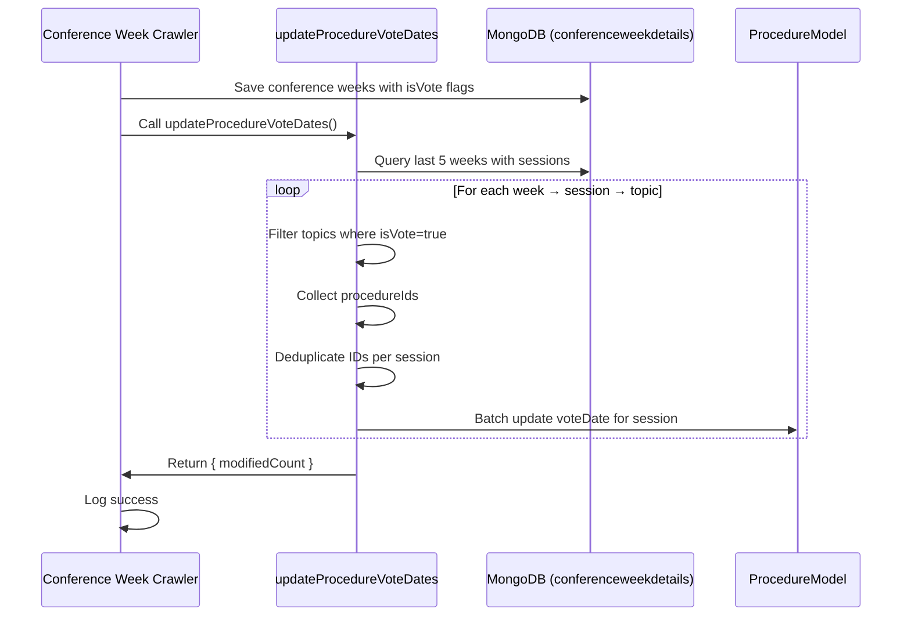
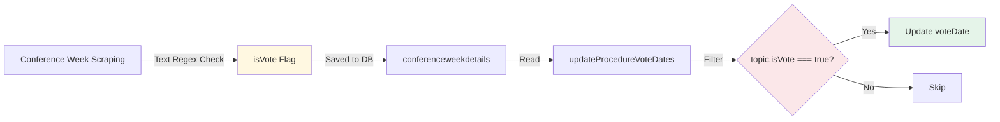

# VoteDate Data Flow

## Inhaltsverzeichnis

- [VoteDate Data Flow](#votedate-data-flow)
  - [Inhaltsverzeichnis](#inhaltsverzeichnis)
  - [Übersicht](#übersicht)
  - [Problemstellung](#problemstellung)
  - [Crawler Direction Strategy](#crawler-direction-strategy)
  - [Datenfluss](#datenfluss)
  - [Komponenten-Übersicht](#komponenten-übersicht)
  - [Detaillierter Ablauf](#detaillierter-ablauf)
    - [Phase 1: Conference Week Crawling](#phase-1-conference-week-crawling)
    - [Phase 2: VoteDate Update](#phase-2-votedate-update)
  - [Sicherheitsmechanismen](#sicherheitsmechanismen)
    - [Mehrfache Validierung](#mehrfache-validierung)
  - [Datenmodelle](#datenmodelle)
    - [Conference Week Detail](#conference-week-detail)
    - [Procedure](#procedure)
  - [Performance-Optimierungen](#performance-optimierungen)
    - [Limitierung auf letzte 5 Conference Weeks](#limitierung-auf-letzte-5-conference-weeks)
  - [Häufige Probleme \& Lösungen](#häufige-probleme--lösungen)
    - [Problem: Procedures haben kein voteDate](#problem-procedures-haben-kein-votedate)
    - [Problem: "Updated 0/X procedures"](#problem-updated-0x-procedures)
    - [Problem: Crawler stoppt nach wenigen Wochen](#problem-crawler-stoppt-nach-wenigen-wochen)
  - [Weitere Dokumentation](#weitere-dokumentation)

## Übersicht

Dieses Dokument beschreibt den vollständigen Datenfluss für die Ermittlung und Speicherung des `voteDate` Feldes in Procedures.

## Problemstellung

Procedures aus der DIP API haben initial **kein voteDate**. Dieses Datum ist jedoch essentiell für:

- Sortierung der Procedures im Frontend
- Anzeige in den "Aktuellen Sitzungswochen"
- Benachrichtigungen über bevorstehende Abstimmungen

Das voteDate muss aus den **Sitzungswochen-Details** des Bundestags extrahiert werden.

---

## Crawler Direction Strategy

**Forward-Only Crawling (seit v2.0):**

Der Conference Week Crawler crawlt **nur zukünftige Wochen** ab der konfigurierten Startwoche (`CONFERENCE_WEEK`). Dies hat mehrere Vorteile:

1. **Relevanz für aktuelle Sitzungswochen:** voteDates werden primär für kommende Abstimmungen benötigt, nicht für historische Daten
2. **Effizienz:** Mit `CRAWL_MAX_REQUESTS_PER_CRAWL` Limit (Default: 10) werden alle Requests für zukünftige Wochen verwendet
3. **Vorhersehbarkeit:** Crawler-Verhalten ist deterministisch - startet bei Week X, endet bei Week X+N

**Hinweis:** `previousYear`/`previousWeek` werden weiterhin in der Datenbank gespeichert (für mögliche Frontend-Navigation), aber **nicht** zum Crawling verwendet.

---

## Datenfluss



---

## Komponenten-Übersicht



---

## Detaillierter Ablauf

### Phase 1: Conference Week Crawling

**Datei:** [`src/index.ts`](../src/index.ts)

**Funktion:** `isVote()`

Der Crawler extrahiert aus der HTML-Struktur:

1. **Sessions** (Sitzungstage mit Datum)
2. **TOPs** (Tagesordnungspunkte)
3. **Topics** (Themen innerhalb der TOPs)

Für jedes Topic wird die `isVote()` Funktion aufgerufen, die den **Text analysiert**:



**Regex-Patterns** aus `@democracy-deutschland/bundestag.io-definitions`:

_Hinweis: Die genauen Regex-Patterns sind im externen Package `@democracy-deutschland/bundestag.io-definitions` (v1.0.2) definiert und werden über `CONFERENCEWEEKDETAIL_DEFINITIONS.TOPIC.*`, `CONFERENCEWEEKDETAIL_DEFINITIONS.HEADING.*` und `CONFERENCEWEEKDETAIL_DEFINITIONS.STATUS.*` referenziert._

Verwendete Pattern-Konstanten:

- `TOPIC.FIND_BERATUNG_ANTRAG` - Prüft auf "Beratung des Antrags"
- `TOPIC.FIND_ERSTE_BERATUNG` - Prüft auf "Erste Beratung"
- `TOPIC.FIND_ZWEITE_DRITTE_BERATUNG` - Prüft auf "Zweite und dritte Beratung"
- `TOPIC.FIND_ZWEITE_BERATUNG_SCHLUSSABSTIMMUNG` - Prüft auf "Zweite Beratung und Schlussabstimmung"
- `TOPIC.FIND_DRITTE_BERATUNG` - Prüft auf "Dritte Beratung"
- `TOPIC.FIND_BERATUNG_BESCHLUSSEMPFEHLUNG` - Prüft auf "Beratung der Beschlussempfehlung"
- `HEADING.FIND_ABSCHLIESSENDE_BERATUNG` - Prüft Heading auf "Abschließende Beratung"
- `STATUS.FIND_ANTRAG_COMPLETED` - Prüft Status auf abgeschlossenen Antrag

**isVote-Funktion Signatur:**

```typescript
const isVote = (
  topic: string,
  heading: string | null | undefined,
  documents: string[],
  status: StatusItem[] | null | undefined,
)
```

**Komplexe Logik für "Beratung des Antrags":**

Dieser Fall ist speziell, da "Beratung des Antrags" sowohl eine erste als auch eine abschließende Beratung sein kann:

- ✅ **Vote (true)**: Wenn Heading "Abschließende Beratung" enthält ODER Status zeigt, dass der Antrag abgeschlossen ist
- ❌ **Kein Vote (false)**: In allen anderen Fällen (vermutlich erste Beratung)

**Ergebnis:** Jedes Topic bekommt ein `isVote: boolean` Flag in der Datenbank.

---

### Phase 2: VoteDate Update

**Datei:** [`src/utils/update-vote-dates.ts`](../src/utils/update-vote-dates.ts)

Nach dem Speichern der Conference Weeks wird automatisch `updateProcedureVoteDates()` ausgeführt:



**Algorithmus:**

1. **Query:** Die letzten 5 Conference Weeks mit Sessions (sortiert nach Jahr/Woche absteigend)
2. **Filter:** Nur Sessions mit `date` ≠ null
3. **Extract:** Alle Topics wo `isVote === true`
4. **Collect:** Alle `procedureIds` aus diesen Topics
5. **Deduplicate:** `[...new Set(procedureIds)]`
6. **Batch Update:** `ProcedureModel.updateMany({ procedureId: { $in: ids } }, { voteDate: sessionDate })`

**Performance-Optimierung:** Durch die Beschränkung auf die letzten 5 Wochen wird die Update-Performance verbessert und der Fokus auf aktuelle/bevorstehende Abstimmungen gelegt.

---

## Sicherheitsmechanismen

### Mehrfache Validierung



**Dreifache Prüfung in `update-vote-dates.ts`:**

```
if (topic.isVote && topic.procedureIds && Array.isArray(topic.procedureIds))
```

1. ✅ `topic.isVote` - Nur wenn Text "Zweite/Dritte Beratung" enthält
2. ✅ `topic.procedureIds` - Nur wenn Procedures verknüpft sind
3. ✅ `Array.isArray()` - Type-Safety gegen undefined/null

---

## Datenmodelle

### Conference Week Detail

**Collection:** `conferenceweekdetails`

**Struktur:**

```
{
  thisYear: 2025,
  thisWeek: 45,
  sessions: [{
    date: "2025-11-05",
    session: "36",
    tops: [{
      topic: [{
        lines: ["Zweite und dritte Beratung..."],
        isVote: true,  // ← Gesetzt durch isVote()
        procedureIds: ["287919", "287920"]
      }]
    }]
  }]
}
```

### Procedure

**Collection:** `procedures`

**Relevante Felder:**

```
{
  procedureId: "287919",
  voteDate: "2025-11-05",  // ← Gesetzt durch updateProcedureVoteDates()
  voteWeek: 45,
  voteYear: 2025
}
```

---

## Performance-Optimierungen

### Limitierung auf letzte 5 Conference Weeks

**Rationale:**

- Reduziert die Anzahl der zu verarbeitenden Dokumente drastisch
- Fokus auf aktuelle und bevorstehende Abstimmungen (die für Nutzer relevant sind)
- Historische voteDates bleiben unverändert in der Datenbank
- Verbessert die Gesamt-Performance des Update-Prozesses

---

## Häufige Probleme & Lösungen

### Problem: Procedures haben kein voteDate

**Mögliche Ursachen:**

1. **Conference Week nicht gecrawlt**

   - Prüfe: `db.conferenceweekdetails.findOne({ thisYear: 2025, thisWeek: 45 })`
   - Lösung: Crawler mit `CONFERENCE_WEEK=45` ausführen

2. **isVote Flag ist false**

   - Prüfe: `db.conferenceweekdetails.findOne(...).sessions[0].tops[0].topic[0].isVote`
   - Ursache: Text enthält nicht "Zweite/Dritte Beratung"
   - Lösung: Regex-Pattern erweitern oder Text-Extraktion prüfen

3. **procedureIds fehlen**

   - Prüfe: `db.conferenceweekdetails.findOne(...).sessions[0].tops[0].topic[0].procedureIds`
   - Ursache: `getProcedureIds()` findet keine Matches
   - Lösung: Document-URL-Matching prüfen

### Problem: "Updated 0/X procedures"

**Bedeutung:** Conference Week hat procedureIds, aber Procedures existieren nicht in DB.

**Ursache:**

- DIP API Crawler hat Procedures noch nicht importiert
- Falsche procedureIds (Document-Matching fehlerhaft)

**Lösung:**

1. DIP API Crawler ausführen: `services/cron-jobs/crawler`
2. Conference Week Scraper neu ausführen
3. Prüfe Document-URLs in beiden Collections

### Problem: Crawler stoppt nach wenigen Wochen

**Ursache:** `CRAWL_MAX_REQUESTS_PER_CRAWL` Limit ist zu niedrig gesetzt (Default: 10).

**Lösung:**

1. Environment Variable `CRAWL_MAX_REQUESTS_PER_CRAWL` auf höheren Wert setzen (z.B. 50-100)
2. Crawler neu starten mit: `CRAWL_MAX_REQUESTS_PER_CRAWL=100 pnpm start`
3. Siehe: [`src/config.ts`](../src/config.ts) für Default-Werte und Konfiguration

---

## Weitere Dokumentation

- [src/index.ts](../src/index.ts) - Haupt-Implementierung
- [src/utils/update-vote-dates.ts](../src/utils/update-vote-dates.ts) - VoteDate Update Utility
