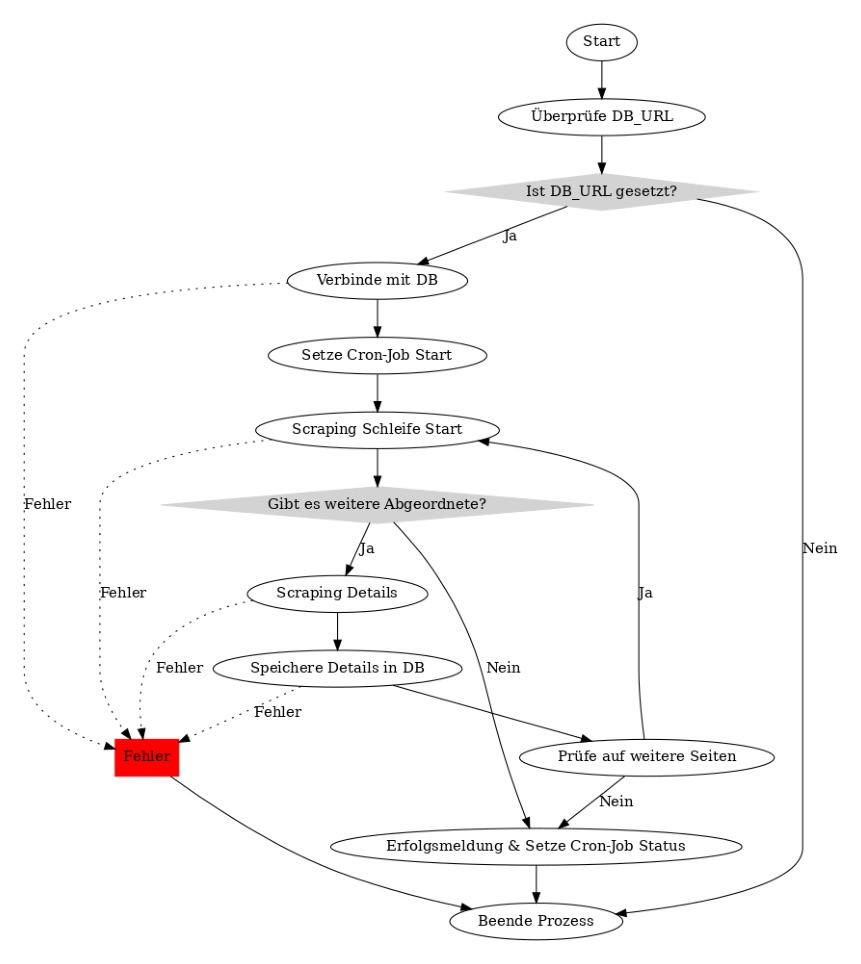

# Abgeordneten-Scraping-Cron-Job

## Überblick

Dieses Projekt beinhaltet ein Skript für einen Cron-Job, der darauf ausgelegt ist, Daten über Abgeordnete (Deputies) von der Website des Bundestags zu scrapen und in einer MongoDB-Datenbank zu speichern. Das Skript durchläuft die Biografien der Abgeordneten verschiedener Wahlperioden, extrahiert relevante Informationen und speichert diese Daten zur weiteren Verwendung und Analyse.

## Funktionsweise

Das Skript beginnt mit einer Überprüfung der erforderlichen Umgebungsvariablen und stellt dann eine Verbindung zu einer MongoDB-Datenbank her. Es verwendet das Scraping-Tool `scrape-it`, um die Daten der Abgeordneten zu extrahieren, einschließlich Details wie Name, Partei, Biografie, Links zu sozialen Medien und mehr. Die Daten werden dann in der Datenbank gespeichert. Der Prozess wird durch regelmäßige Logs und Fehlerbehandlung überwacht.

## Ablaufdiagramm

Das folgende Ablaufdiagramm veranschaulicht den Prozess, der im Skript implementiert ist:

