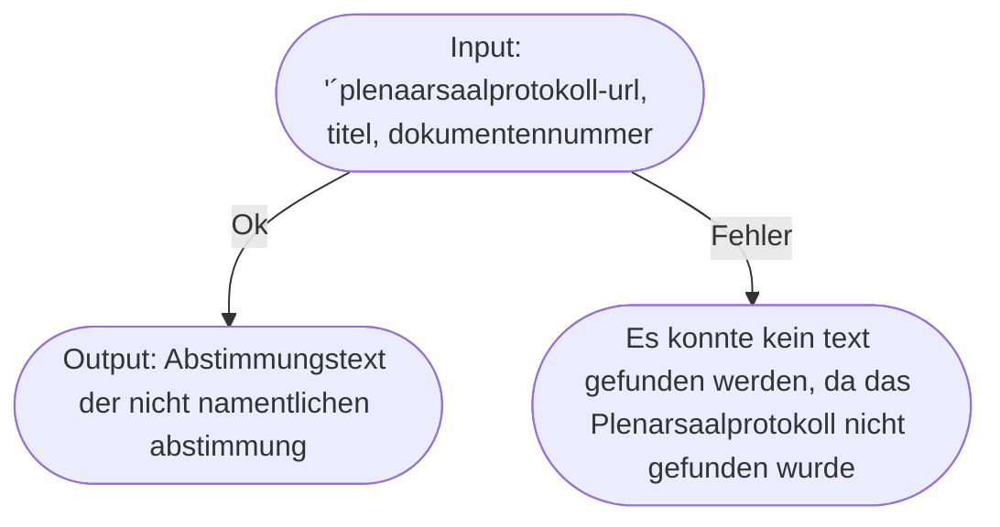
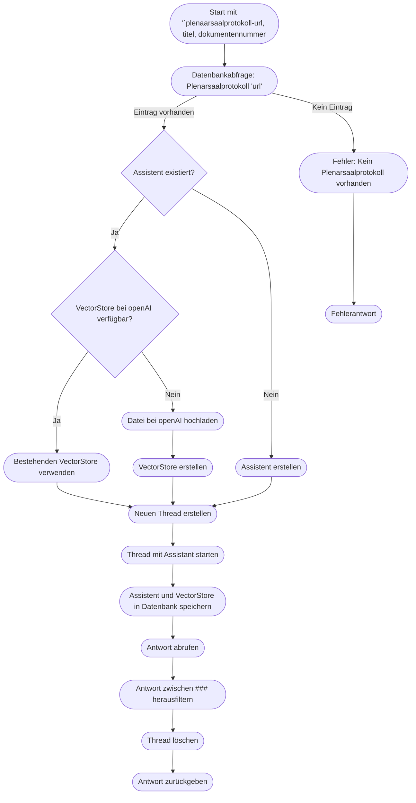

# Flow Charts

Dieser Service liefert den Textabschnitt, in dem über eine **nicht namentliche Abstimmung** abgestimmt wird. Dafür benötigt er eine **URL** zu einem PDF mit einem Plenarsaalprotokoll, den **Titel** der Gesetzgebung oder des Antrags und optional die **Dokumentennummer**.

## High Level

## In Deep

