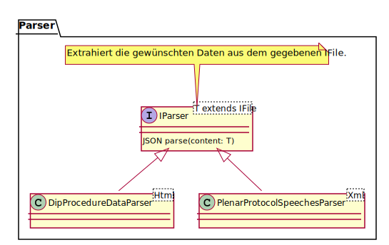
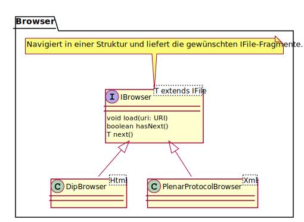
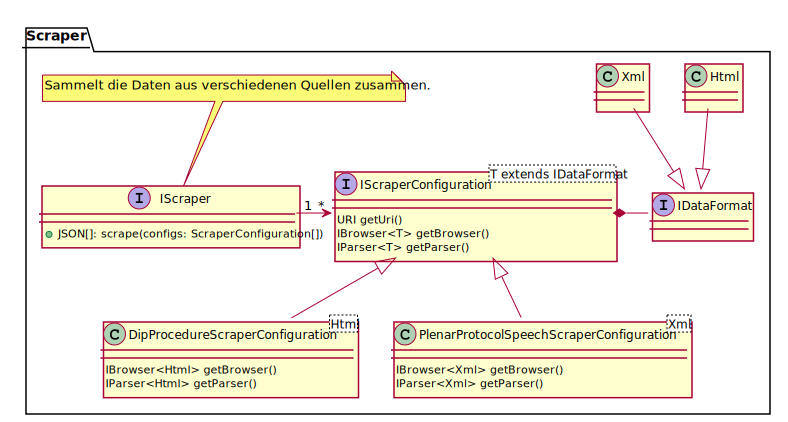

# scapacra
## Introduction
Scapactra (scraper, parser and crawler) is a framework to extract data from different data sources.
The idea for scapactra bases on the ETL (extract, transform and load) process ([ETL](https://de.wikipedia.org/wiki/ETL-Prozess "ETL (extract, transform and load)")) and defines an modular design pattern providing a basic ETL workflow.

The framework is structured into three basic modules.
1. **Parser**:
   The parser extracts the data from a defined document.
2. **Browser**:
   The browser navigates through a structure and retrieves the desired fragments for the parser.
3. **Scraper**:
   A scraper executes the browsers an parsers and providing their results over an centralized interface.

## Parser

## Browser

## Scraper

